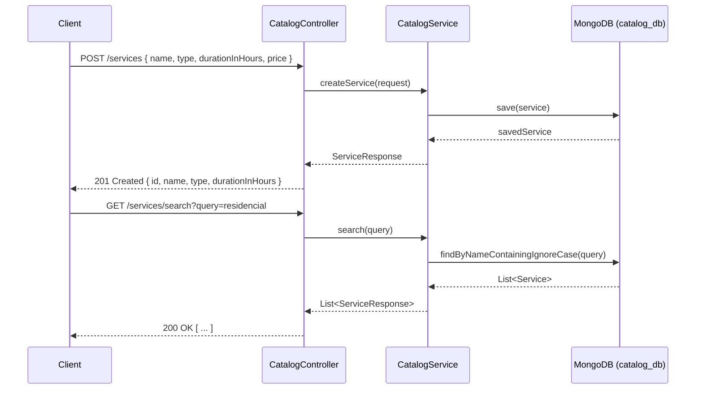
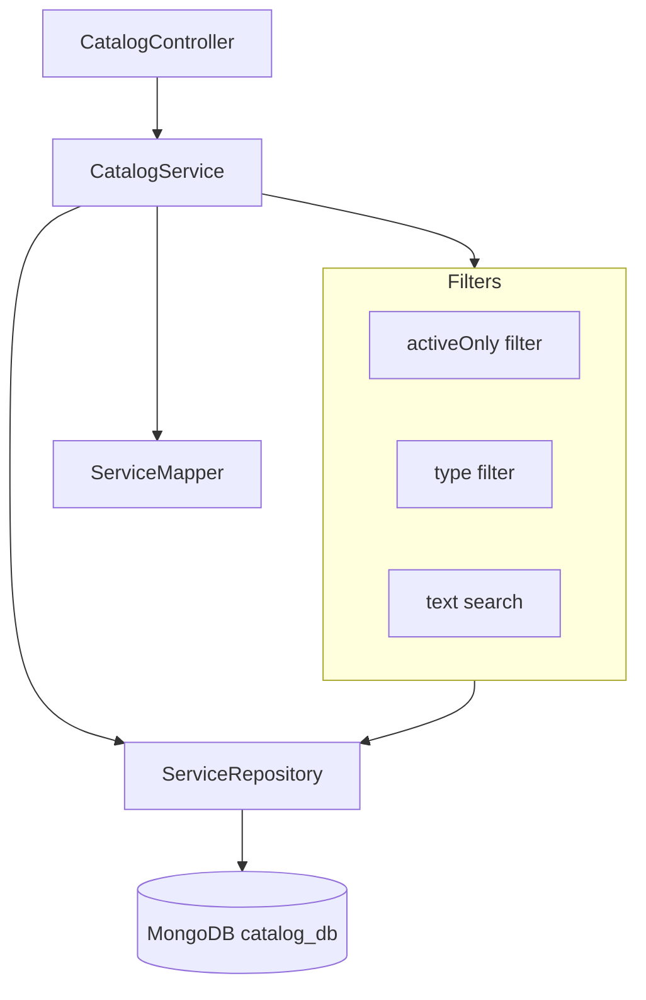

# 📋 Catalog Service

Microservice responsible for managing the portfolio of cleaning services available on the Clean Pro Solutions platform. Handles service definitions, categories, and searchable catalog entries.

---

## 📋 Service Info

| Property     | Value                       |
|--------------|-----------------------------|
| Port         | `8083`                      |
| Database     | MongoDB — `catalog_db`      |
| RabbitMQ     | Not used                    |
| Registry     | Eureka (`catalog-service`)  |

---

## 🔄 Main Flow — Sequence Diagram



---

## 🏗️ Internal Architecture



---

## 📡 API Endpoints

| Method | Path                    | Request Body / Params             | Response                          |
|--------|-------------------------|-----------------------------------|-----------------------------------|
| POST   | `/services`             | `{ name, type, durationInHours, price, description }` | `201 ServiceResponse` |
| GET    | `/services`             | —                                 | `200 [ ServiceResponse ]`         |
| GET    | `/services`             | `?activeOnly=true`                | `200 [ ServiceResponse ]`         |
| GET    | `/services`             | `?type=RESIDENTIAL`               | `200 [ ServiceResponse ]`         |
| GET    | `/services/{id}`        | —                                 | `200 ServiceResponse`             |
| GET    | `/services/search`      | `?query=limpeza`                  | `200 [ ServiceResponse ]`         |
| PUT    | `/services/{id}`        | `{ name, type, durationInHours, price, active }` | `200 ServiceResponse` |
| DELETE | `/services/{id}`        | —                                 | `204 No Content`                  |

> **Note:** The duration field is `durationInHours` (decimal, e.g. `2.5`), not `estimatedDurationMinutes`.

---

## ⚙️ Environment Variables

| Variable                    | Description              | Default                                  |
|-----------------------------|--------------------------|------------------------------------------|
| `SPRING_DATA_MONGODB_URI`   | MongoDB connection URI   | `mongodb://localhost:27017/catalog_db`   |
| `EUREKA_SERVER_URL`         | Eureka registry URL      | `http://localhost:8761/eureka`           |

---

## 🚀 Build & Run

### Build
```bash
mvn clean install
```

### Run locally
```bash
mvn spring-boot:run
```

### Run with Docker Compose
```bash
docker-compose up catalog-service
```

---

## 🧪 How to Test

### Create a service
```bash
curl -X POST http://localhost:8083/services \
  -H "Content-Type: application/json" \
  -d '{
    "name": "Limpeza Residencial Completa",
    "type": "RESIDENTIAL",
    "durationInHours": 3.0,
    "price": 250.00,
    "description": "Limpeza completa de residências até 100m²"
  }'
```

### List all active services
```bash
curl "http://localhost:8083/services?activeOnly=true"
```

### Filter by type
```bash
curl "http://localhost:8083/services?type=COMMERCIAL"
```

### Search by name
```bash
curl "http://localhost:8083/services/search?query=limpeza"
```

### Update a service
```bash
curl -X PUT http://localhost:8083/services/64a1b2c3d4e5f6a7b8c9d0e1 \
  -H "Content-Type: application/json" \
  -d '{
    "name": "Limpeza Residencial Completa",
    "type": "RESIDENTIAL",
    "durationInHours": 4.0,
    "price": 300.00,
    "active": true
  }'
```

---

## 🗂️ Project Structure

```
clean-pro-solutions-catalog/
├── src/main/java/
│   └── com/cleanpro/catalog/
│       ├── controller/     # REST endpoints
│       ├── service/        # Business logic
│       ├── repository/     # MongoDB repositories
│       ├── dto/            # Request/Response records
│       ├── model/          # Service entity
│       ├── mapper/         # Entity <-> DTO mapping
│       └── exception/      # Custom exceptions
├── src/test/
└── pom.xml
```
